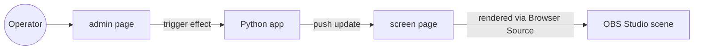

# OBS_director — Architecture

## Summary
A Python backend serves two web pages:

- `screen` — transparent overlay page, added as an OBS Browser Source.
- `admin` — control panel page used to trigger effects that appear on `screen`.

## Current state
No implementation exists yet. Concrete choices below are undecided and are expected to be
proposed by the architect agent as part of planning the first real changes:

- Web framework (e.g. FastAPI/Flask/other) for serving `admin` and `screen` and any API.
- Real-time channel used by `admin` to push state to `screen` (websockets vs. SSE vs. polling).
- Project/package layout (where `screen`, `admin`, shared effect logic, and static assets live).
- How individual visual effects are defined/registered so `admin` can discover and trigger them.

## Diagram

## Open architecture questions
- Real-time channel between `admin` and `screen`: websockets, SSE, or polling?
- Web framework choice, and whether `admin`/`screen` are server-rendered or a JS frontend.
- Should `screen` support multiple independent overlay layers/effects running concurrently?
