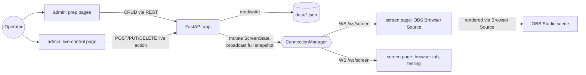

# OBS_director — Architecture

## Summary
A Python backend (FastAPI, served via Uvicorn) serves two web pages:

- `screen` — transparent overlay page, added as an OBS Browser Source. Renders one fixed-
  position CSS region per effect family, each driven by a small client-side JS module.
- `admin` — control panel, split into prep pages (per-entity content authoring) and a single
  live-control page (every mid-stream action for every effect).

Both pages are server-rendered with Jinja2 templates; there is no frontend build step — client
behavior is vanilla JS/CSS. State is pushed from server to `screen` over a WebSocket.

## Framework and rendering
- **FastAPI + Uvicorn**, chosen for native async WebSocket support, Pydantic request/response
  models, and OpenAPI docs on the admin API "for free."
- **Jinja2** server-rendered templates for both `admin` and `screen`; **vanilla JS + CSS** (no
  bundler/build step) for client behavior. Each effect's animation is CSS keyframes/transitions
  driven by a small per-effect JS module on the `screen` page (`static/screen/effects/*.js`).

## Real-time channel
**WebSocket broadcast of a single authoritative state object**, resolving the previously open
"websockets vs. SSE vs. polling" question in favor of websockets:

- Admin actions are plain HTTP `POST`/`PUT`/`DELETE` calls to explicit REST endpoints — there is
  no generic dynamic dispatcher. Each request is parsed into the relevant effect module's
  Pydantic model and handled by that module's `apply_*` function.
- Each mutation updates one field/slot of an in-memory `ScreenState` object held by the server,
  then the server broadcasts the **entire** updated state as a JSON snapshot to every connected
  `/ws/screen` client via `ConnectionManager`.
- New WebSocket connections receive the current state immediately on connect, so a `screen`
  page reloading (e.g. OBS Browser Source refresh) or a second browser tab used for testing
  always resyncs to the same state as every other connected client — there is one server-side
  source of truth.

## Concurrency / layer model
`ScreenState` is flat, with one independent field/slot per effect family:

```
ScreenState:
  speaker_left:  SpeakerSlot | None      # independent per-side slots
  speaker_right: SpeakerSlot | None
  community_message: CommunityMessageSlot | None
  whatsapp: WhatsAppSlot | None
  timer_big:    TimerSlot | None
  timer_corner: TimerSlot | None
  alarm: AlarmSlot | None
```

`screen.html` has one fixed-position CSS region per family (left/right speaker banner strip —
width dynamic depending on which sides are occupied, community-message region, a full-viewport
WhatsApp panel, big-centered/corner timer slots, top/bottom alarm strip), with a documented
static z-index stack: alarm topmost, then the WhatsApp full-screen takeover, then community
message, then speaker banners, then timers lowest. Each region's JS module subscribes only to
its slice of state and independently drives its own enter/exit animation sequencing — that
sequencing lives entirely in client JS; the server only holds and broadcasts state (there is no
server-side animation sequencer).

At minimum, speaker banner(s), community message, timer(s), and alarm can all be visible at
once in their own regions without interference. WhatsApp is the deliberate exception: while
playing, it takes over the full frame; other slots' state is preserved underneath (not cleared)
and reappears once WhatsApp is stopped.

## Effect module structure
Each effect gets a module under `obs_director/effects/` (`speaker.py`, `community_message.py`,
`whatsapp.py`, `timer.py`, `alarm.py`) exposing Pydantic action-payload model(s) plus pure
`apply_*(state, payload) -> state` functions and any effect-specific pure logic (e.g.
`timer.py::value_at`, `whatsapp.py::reveal_count`, `speaker.py::banner_width`/
`default_description`). Routing is an explicit set of REST endpoints under
`obs_director/routers/`, one route per live action; each route parses its request into the
corresponding effect module's model, calls that module's `apply_*` function, and broadcasts the
resulting state. Adding a future effect means: add its module, add its route(s), add its
screen-side JS/CSS module and template region.

## Persistence
Per-entity JSON files under `data/` (`data/speakers.json`, `data/conversations.json`,
`data/alarm_presets.json`), loaded/rewritten via `obs_director/storage.py`, each repository
function taking an optional data-directory override for test isolation. This is a single local
operator tool with no concurrent-writer contention, so a file-backed store avoids standing up
SQLite/migrations while still being durable and human-inspectable/editable. Live/ephemeral
effect state (`ScreenState` itself, including timers and the current community message) is
in-memory only and is not persisted — it resets on server restart, while the reusable libraries
(speakers, WhatsApp conversations, alarm presets) survive restarts.

## Project layout
```
obs_director/
  app.py                  # FastAPI app factory: mounts static files, includes every router
  config.py                # env-driven settings (data dir, host, port)
  templating.py            # shared Jinja2 environment/helpers
  state.py                 # ScreenState model + ConnectionManager (WS broadcast)
  storage.py                # JSON-file repositories: speakers, conversations, alarm presets
  models.py                 # Pydantic models for persisted entities + live-slot payloads
  effects/
    speaker.py  community_message.py  whatsapp.py  timer.py  alarm.py
  providers/
    base.py                # MessageProvider ABC
    manual.py               # NoOpProvider (always returns [])
  routers/
    pages.py                # admin/screen page routes
    speakers_api.py  whatsapp_api.py  alarm_presets_api.py   # prep-entity CRUD
    community_api.py        # search endpoint (always empty in this release)
    live_api.py              # every live-control action, across all five effects
    screen_ws.py              # WS /ws/screen endpoint
  templates/
    base.html
    admin/  (live.html, speakers.html, whatsapp.html, alarms.html)
    screen/screen.html
  static/
    admin/ (admin.css, live.js, speakers.js, whatsapp.js, alarms.js)
    screen/ (screen.css, screen.js, ws-client.js, effects/*.{js,css})
data/
  speakers.json  conversations.json  alarm_presets.json
tests/
main.py                     # entry point: `python main.py` runs uvicorn against obs_director.app:app
```

The router split is one module per resource area (rather than a single `admin.py`/`live.py`),
kept flat and explicit per the "no generic dispatcher" principle above — every live action and
every CRUD operation is its own named route.

The admin UX constraint — many prep pages, but exactly one live-control page for everything the
operator touches mid-stream — is implemented directly in this layout: `routers/live_api.py` and
`templates/admin/live.html` are the only page/router exposing select/dismiss/trigger controls
for all five effects; the prep routers/templates (`speakers_api.py`/`speakers.html`,
`whatsapp_api.py`/`whatsapp.html`, `alarm_presets_api.py`/`alarms.html`) are purely for building
the reusable libraries ahead of time.

## Diagram


## Open architecture questions
None outstanding for this release. Future work to revisit if scope grows: whether a sixth
concurrent effect changes the flat single-`ScreenState`-object model, and whether a real
community-message provider needs its own auth/rate-limit handling layer beyond
`providers/base.py`.
