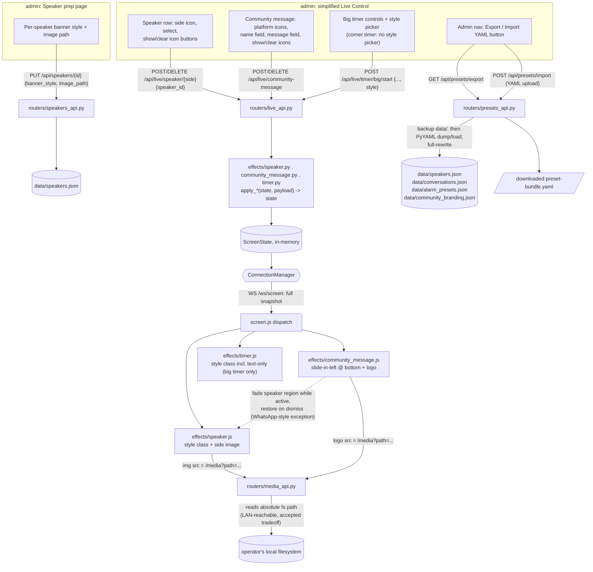

# OBS_director — Plans

Append-only log of implemented change plans, most recent last. Each entry is produced by the
`coordinator` agent and appended here by the `documenter` agent once a change has been
implemented.

---

# OBS_director First Release: Five Live Overlay Effects (Speaker Banners, Community Message, WhatsApp Simulator, Timers, Alarm) - 2026-09-02 19:13 BST

## Context of the changes

`docs/product.md` currently describes OBS_director only at the vision level: two pages (`screen`, an OBS Browser Source overlay, and `admin`, the operator's control panel), no features built yet, and one open question — "what should the first effect be." This change answers that question decisively and supersedes it: instead of a single validating effect, the first real release ships **five effects at once**, all wired through the same `screen`/`admin` split, because the user wants a coherent first release rather than an incremental single-feature slice. `docs/architecture.md` is fully undecided (framework, real-time channel, layout, effect-registration model) — this change explicitly asks the architect to resolve those as part of this plan rather than leave them open, since five concurrent, independently-controlled effects is exactly the kind of scope that makes "websockets vs. polling," "server-rendered vs. JS frontend," and "how effects register" load-bearing decisions.

The five effects, from a product point of view:

1. **Speaker presentation** — a lower-third-style banner naming a speaker. It's a "prep ahead, trigger live" workflow: the operator builds a reusable speaker roster in admin (name + optional description, persisted across sessions/restarts), then during the stream picks a speaker and a screen side (left/right) to display them. The side selection is per-instance, not global — nothing in the request says only one speaker can be shown at a time; the "never two banners on the same side" rule is explicitly scoped per side, which implies two speakers (one left, one right) can be on screen simultaneously, e.g. for a two-person interview. Swapping the speaker on a given side plays an out-animation for the old one before the in-animation for the new one, so a side never shows two names overlapping. **[Finalized: confirmed as two independent per-side slots — see Deep Dive Q1 for the added dynamic-width requirement.]**

2. **Community message** — a social-media-styled callout, fed by two authoring paths that converge on the same on-screen presentation: importing a real message from a connected social account, or hand-writing free text and picking which platform's visual style to mimic. This is the one feature with a genuine external-integration fork (see Deep Dive Q2 for the finalized v1 scope).

3. **WhatsApp discussion simulator** — pre-authored, named, fake chat scripts (ordered messages, each tagged incoming/left-with-sender-name or outgoing/right-with-timestamp-and-read-receipts), played back live as a full-screen animated conversation. Notably, the user's own concurrency example ("speaker banner + community message + timer + alarm all live at once") pointedly omits the WhatsApp simulator — consistent with it being described as "takes over the full screen," i.e. the one effect that is not meant to layer alongside the others but to dominate the frame while active.

4. **Timers** — at least two placements (big centered, and a corner badge) and at least two modes (countdown-to-zero from a set duration, and count between an arbitrary configured start and end value, not just count-up-from-zero). Both placements are independent layers, so a centered timer and a corner timer can run at once with different modes/values.

5. **Big red alarm** — a bold, high-contrast red banner (top or bottom, centered) for a "something's wrong / pay attention" moment, in the spirit of a loud alert, with content that can be composed/prepared in admin ahead of time and triggered/dismissed live with a single action. **[Finalized: includes real siren audio — see Deep Dive Q3.]**

Cross-cutting product requirement: admin is split into **prep surfaces** (manage the speaker roster, author WhatsApp conversations, save alarm presets, and whatever setup timers need) and exactly **one live-control surface** that has to contain every action the operator needs mid-stream: select/deselect speaker+side (independently per side), pick or compose the community message and its style, launch/stop a saved WhatsApp conversation, configure/start/stop each timer instance, and trigger/dismiss the alarm. This is a deliberate, explicit constraint from the user, not a suggestion — the operator must never need to leave that one page while recording.

Concurrency is also explicit: speaker banner(s), community message, timer(s), and alarm are independent visual layers on `screen` and must be able to be live simultaneously, since they occupy visually distinct regions (banners at the sides/bottom, timers centered/corner, alarm top-or-bottom-center, community message presumably a corner/side toast-like region). The WhatsApp simulator is the deliberate exception that takes over the whole frame.

### Acceptance criteria

**Cross-cutting / admin structure**
- Admin has a single "Live control" page/section reachable without navigation during a stream, containing every live action for all five features: speaker select+side (per side), community message pick/compose+style, WhatsApp conversation launch/stop, timer configure/start/stop (both placements independently), alarm trigger/dismiss.
- Admin has separate prep page(s)/section(s) for: managing the speaker roster (add/edit/remove speaker name+description), authoring/editing named WhatsApp conversations and their messages, and composing/saving alarm presets (at least a default alarm text/style, with the option to customize before triggering).
- Speaker roster and WhatsApp conversations persist across app restarts (not just in-memory for the current process).
- Multiple `screen` clients (e.g. the real OBS Browser Source plus a browser tab used for testing) reflect identical, synchronized state — there is one server-side source of truth for what's currently showing.
- At minimum, speaker banner(s), community message, timer(s), and alarm can all be visible on `screen` at the same time, in their own screen regions, without one effect's animation or state interfering with another's.

**1. Speaker presentation**
- Operator can create/edit/delete speakers in the prep page: full name (required) and description/title (optional).
- If description is left blank, `screen` shows the banner without a redundant/empty subtitle rather than fabricating filler text (name occupies the banner; no second line is rendered).
- From live control, operator selects a speaker and a side (left/right) independently for each side; selecting for a side that already has a speaker showing plays that speaker's out-animation (matching its side) before the new speaker's in-animation plays (matching the newly selected side).
- Deselecting a speaker (per side) plays the out-animation and clears that side; nothing else is affected.
- Name renders large/dominant on the banner; description renders smaller, both introduced via a directional entrance animation matching the selected side, followed by the name "materializing" (a distinct visual beat, not just a plain fade).
- **[Finalized addition, see Deep Dive Q1]:** banner width is dynamic — if the opposite side's slot is empty, the occupied side's banner takes up most of the screen width (wide/prominent); if both sides are occupied simultaneously, each banner narrows to share the screen (e.g. roughly half-width each). Enter/exit/materialize animations still work exactly as designed per side; the width transition should itself animate smoothly rather than jump-cut when the opposite side's occupancy changes.

**2. Community message**
- Operator can compose a free-text message and pick a platform visual style (at minimum the platforms named: X, Discord, Facebook, WhatsApp) from live control; on submit, it appears on `screen` with an entrance animation and is visually styled to resemble that platform. This free-text+style path must be fully functional in v1 (see Deep Dive Q2).
- Operator can browse/search a list of importable messages via a provider abstraction; **for v1, no concrete provider is wired up (search returns no results)** — see Deep Dive Q2. The abstraction must be built so a real platform provider can be added later without reworking the rendering path.
- Both paths converge on the same on-screen rendering/animation pathway.
- Only one community message is shown at a time; showing a new one replaces the previous one using the same animate-out-then-in sequencing as the speaker banner (see Deep Dive Q7), and the operator can dismiss it entirely from live control.

**3. WhatsApp discussion simulator**
- Operator can create/edit/delete named conversations in the prep page; each conversation is an ordered list of messages, each tagged left/incoming (renders with sender name) or right/outgoing (renders with timestamp + blue double-check marks), matching real WhatsApp visual conventions.
- From live control, operator can launch a saved conversation by name; it takes over the full `screen` frame and plays messages in one at a time with a "live arrival" animation/pacing (fixed interval, see Deep Dive Q11), in authored order.
- After the last message, the full conversation remains visible (doesn't auto-clear) until the operator stops/dismisses it from live control, at which point `screen` returns to showing whatever other effects (speaker/timer/alarm/community message) are still active in their normal regions (their state is preserved underneath throughout — see Deep Dive Q8).
- Only one conversation plays at a time.

**4. Timers**
- Operator can configure and independently start/stop two timer instances: one big/centered, one corner (top-right or bottom-right, operator's choice).
- Each instance supports two modes, selectable and configurable from live control: countdown from a configured duration to zero, and count between a configured start value and a configured end value.
- Timers are visually legible against a transparent background at both placements/sizes.
- Reaching the configured end value is visually distinct (e.g. a flourish/flash) rather than silently continuing past it or abruptly vanishing.
- Timers are configured ad hoc directly on the live control page; no separate timer-preset persistence is required for v1 (see Deep Dive Q9).

**5. Big red alarm**
- Operator can trigger the alarm from live control with one action, using either a saved preset (composed ahead of time in the prep area) or the default alarm content if no preset is chosen.
- Alarm renders as a bold, high-contrast red banner/effect, centered at the top or bottom of the frame, with an attention-grabbing entrance/looping animation ("whining"/pulsing in spirit) **and real siren audio** (see Deep Dive Q3), played through the browser tab so it is present on the Browser Source's audio track.
- Operator can dismiss the alarm from live control with one action at any time; it does not auto-dismiss on a timer unless that's explicitly part of a preset's configuration.

## Architectural Impact

This is the first real feature set for OBS_director, landing on greenfield docs (`docs/architecture.md` lists framework, real-time channel, layout, and effect-registration as all open, and `docs/code.md`/`docs/plans.md` are empty stubs). These open questions are resolved concretely as part of this change.

**Framework: FastAPI + Uvicorn, server-rendered Jinja2 templates, vanilla JS on the client.** FastAPI gives native async WebSocket support, Pydantic models for the five effects' payloads, and OpenAPI docs "for free" on the admin action endpoints. No frontend build step — `admin` and `screen` stay simple HTML/CSS/JS. Each effect's animation is CSS keyframes/transitions driven by small per-effect JS modules on the `screen` page.

**Real-time channel: WebSocket broadcast of a single authoritative state object.** Admin actions are plain HTTP `POST` calls to explicit REST endpoints (see Code changes — there is no generic dynamic dispatcher, see Deep Dive Q10). Each POST mutates one field of an in-memory state object held by the server, then the server broadcasts the *entire* updated state to every connected client. New WS connections get the current state immediately on connect, so OBS reloading the Browser Source recovers state correctly. This resolves the doc's open "websockets vs SSE vs polling" question in favor of websockets.

**Concurrency / layer model.** The state object is flat, with one independent sub-object per effect family (the authoritative field-by-field shape is the `ScreenState` model in Code changes — see Deep Dive Q12):

```
state = {
  speaker:  { left: SpeakerSlot|null, right: SpeakerSlot|null },   # two independent per-side slots — Deep Dive Q1
  community_message: { active: null | {text, style, source} },
  whatsapp: { active: null | {conversation_id, messages: [...]} },
  timers:   { big: TimerState|null, corner: TimerState|null },
  alarm:    { active: bool, position: "top"|"bottom" }
}
```

`screen.html` has one fixed-position CSS region per family (left/right speaker banner strip — width dynamic per Deep Dive Q1, community-message region, a full-viewport whatsapp panel, big-centered/corner timer slots, top/bottom alarm strip) with a documented static z-index stack (alarm topmost, then whatsapp full-screen takeover, then community message, then speaker banner, then timers lowest). Each region's JS module subscribes to only its slice of state and independently drives its own enter/exit animation sequencing — this sequencing lives entirely in client JS, the server just holds/broadcasts state.

**Effect module structure (reconciled per advisor review — see Deep Dive Q10)**: each effect gets a module under `obs_director/effects/` (`speaker.py`, `community_message.py`, `whatsapp.py`, `timer.py`, `alarm.py`) exposing Pydantic action-payload model(s) plus `apply_*(state, payload) -> state` function(s). Routing is the explicit set of REST endpoints in `obs_director/routers/` (see Code changes), one route per live action, each route parsing its request into the corresponding effect module's model and calling that module's `apply_*` function, then broadcasting the resulting state. Adding a sixth effect later means: add its module, add its route(s), add its screen-side JS/CSS module and template partial.

**Persistence: per-entity JSON files under `data/`** (`data/speakers.json`, `data/conversations.json`, `data/alarm_presets.json`), loaded/rewritten via `obs_director/storage.py`. This is a single local operator tool with no concurrent-writer contention, so a file-backed store avoids standing up SQLite/migrations for v1 while still being durable and human-inspectable/editable. **This is the authoritative persistence decision** — see Deep Dive Q4.

**Project layout** (authoritative package name is `obs_director/`, see Deep Dive Q4 — actual implemented layout, see the Deviations note under Code changes for the router-file split actually used):
```
obs_director/
  app.py / main.py       # FastAPI app factory, mounts routers/static/templates, WS endpoint
  state.py               # ScreenState model + ConnectionManager (WS broadcast)
  storage.py             # JSON-file repositories: speakers, conversations, alarm presets
  models.py              # Pydantic models for all entities + ScreenState
  effects/
    speaker.py  community_message.py  whatsapp.py  timer.py  alarm.py
  providers/
    base.py  manual.py (no-op provider)
  routers/
    (explicit route modules — see Deviations for actual file split)
  templates/  (admin/live.html, admin/speakers.html, admin/whatsapp.html, admin/alarms.html, screen/screen.html, base.html)
  static/  (admin/*.css,*.js ; screen/screen.css, screen.js, ws-client.js, effects/*.{js,css})
data/
  speakers.json  conversations.json  alarm_presets.json
tests/
```

The user's explicit admin UX constraint — many prep pages, but **one** live-control page for everything the operator touches mid-stream — is implemented directly: the live-control page/router is the only page rendering select/dismiss/trigger controls for all five effects; the prep routers/templates are purely for building the reusable libraries ahead of time and are never needed once recording starts.

## Code changes

**Stack** (Python): **FastAPI** + **uvicorn[standard]**; **Jinja2** server-rendered `admin`/`screen` HTML shells; **vanilla JS + CSS** (no build step) for animations and the WebSocket client; **WebSocket** (`/ws/screen`) as the push channel; **JSON-file repositories** (`obs_director/storage.py`) for speakers, WhatsApp conversations, alarm presets. Timers and community messages are live/ephemeral — not persisted.

### Persistence / data model (JSON files)
- `speakers.json`: list of `{id, name, description: str|null, created_at}`
- `conversations.json`: list of `{id, name, created_at, messages: [{id, order_index, direction: "left"|"right", sender_name: str|null, body, timestamp_label: str|null}]}`
- `alarm_presets.json`: list of `{id, label, created_at}`

### Live screen state (`state.py`, in-memory, not persisted — authoritative shape, see Deep Dive Q12)
```python
class ScreenState:
    speaker_left: SpeakerSlot | None = None
    speaker_right: SpeakerSlot | None = None   # two independent per-side slots — Deep Dive Q1
    community_message: CommunityMessageSlot | None = None
    whatsapp: WhatsAppSlot | None = None
    timer_big: TimerSlot | None = None
    timer_corner: TimerSlot | None = None
    alarm: AlarmSlot | None = None
```
(Implemented as a Pydantic `BaseModel`, not a plain dataclass, for free JSON serialization — see Deviations.)

Every mutation (`effects/*.apply_*`) updates one slot and calls `ConnectionManager.broadcast(state)`, which sends the **full state snapshot** as JSON to every connected `/ws/screen` socket, including immediately on connect (so a reconnecting Browser Source resyncs correctly).

Slot payload shapes:
- `SpeakerSlot{speaker_id, name, description, side}` — `side` drives entrance/exit direction client-side. The client computes banner width from whether the *other* side's slot is occupied (Deep Dive Q1): both slots present -> narrow/shared width each; only one present -> wide/prominent width, animated smoothly on change.
- `CommunityMessageSlot{platform, author, avatar_url|None, text, timestamp_label|None}` — same shape whether from search-import or custom-text; both paths funnel through `effects/community_message.py::apply_community_message()`.
- `WhatsAppSlot{conversation_id, messages: [...], started_at_epoch_ms, message_interval_ms}` — server says "play this conversation starting at time T"; screen JS computes revealed-message count from elapsed time since `started_at_epoch_ms`, so a reconnect resumes correctly. **Message reveal pacing (Deep Dive Q11):** fixed `message_interval_ms=1500` (1.5s) between reveals, set server-side at launch, not proportional to length, not operator-configurable in v1.
- `TimerSlot{start_seconds, end_seconds, anchor_epoch_ms, paused_offset_seconds, running, position}` — a single generalized "range timer": `displayed(now) = start_seconds + direction*(elapsed)`, clamped at `end_seconds`, covering both countdown-to-zero and count-from-A-to-B with one model. Pure function `effects/timer.py::value_at(now, slot)`, mirrored client-side in `screen/effects/timer.js` for smooth ticking (server only pushes on Start/Pause/Reset).
- `AlarmSlot{label|None, position: "top"|"bottom"}` — presence/absence = active/dismissed. **Audio (Deep Dive Q3):** when active, `screen/effects/alarm.js` plays a looping siren (synthesized via Web Audio oscillator, no bundled audio asset) for as long as the slot is present, stopping on dismiss, triggered off the state-change event (not page load) to help with autoplay policy. OBS must be configured to capture that Browser Source's audio track for the siren to be heard in the stream/recording — documented in code comments and this doc.

### Routes (explicit, no generic dispatcher — Deep Dive Q10)
- Prep pages: `GET /admin/speakers`, `GET /admin/whatsapp`, `GET /admin/alarms`
- Live control: `GET /admin/live` — the single page with every live action for all five effects
- `GET /screen`, `WS /ws/screen`
- REST, prefixed `/api`: `GET/POST/PUT/DELETE /api/speakers[/{id}]`; `GET/POST/PUT/DELETE /api/whatsapp/conversations[/{id}]`, message sub-routes nested under their conversation (see Deviations); `GET/POST/DELETE /api/alarm-presets[/{id}]`; `GET /api/community/search?platform=&q=` (always `[]` in v1, Deep Dive Q2); live actions: `POST/DELETE /api/live/speaker/{side}`, `POST/DELETE /api/live/community-message`, `POST /api/live/whatsapp/play`, `POST /api/live/whatsapp/stop`, `POST /api/live/timer/{slot}/start`, `.../pause`, `.../reset`, `DELETE /api/live/timer/{slot}`, `POST /api/live/alarm/trigger`, `POST /api/live/alarm/dismiss`.

### Per-feature implementation notes
1. **Speaker** — `effects/speaker.py::default_description(name)` returns nothing (no fabricated filler text, Deep Dive Q5). Per-side client state machine plays exit-then-enter animations correctly; width recomputed on either slot's occupancy change (Deep Dive Q1). Editing a live speaker's roster entry does not retroactively update the banner (Deep Dive Q6); deleting one clears that side.
2. **Community message** — `providers/base.py::MessageProvider` ABC, no concrete provider in v1 (Deep Dive Q2), free-text+style path fully functional. Both paths render via one `screen/effects/community_message.js` path with a `platform` CSS modifier class. Replacement uses the same animate-out-then-in sequencing as speaker (Deep Dive Q7).
3. **WhatsApp simulator** — prep page authors ordered, directional messages; `POST /api/live/whatsapp/play` snapshots the conversation into `WhatsAppSlot` with `started_at_epoch_ms=now`, `message_interval_ms=1500`. Full-viewport overlay reveals messages via elapsed-time math (Deep Dive Q11); other slots are preserved but visually covered while active (Deep Dive Q8), reappearing on stop.
4. **Timers** — one `TimerSlot` model for both `timer_big` and `timer_corner`; pure `value_at()` function unit-tested; ad hoc configuration only, no presets in v1 (Deep Dive Q9).
5. **Alarm** — `AlarmSlot` presence toggles a pulsing red banner plus looping synthesized siren; optional label from a saved preset or typed ad hoc (Deep Dive Q3).

### Deviations from the original plan (as implemented)
- `ScreenState` is a Pydantic `BaseModel`, not a `dataclasses.dataclass` — same fields/semantics, gives `.model_dump_json()` for the broadcaster for free.
- Router files are split more granularly, one module per resource (`pages.py`, `speakers_api.py`, `whatsapp_api.py`, `alarm_presets_api.py`, `community_api.py`, `live_api.py`, `screen_ws.py`) rather than the plan's `live.py`/`speakers_prep.py`/... sketch — same explicit-route philosophy (Deep Dive Q10), organized differently for clarity.
- WhatsApp message-level routes are nested under their conversation (`/api/whatsapp/conversations/{conversation_id}/messages/{message_id}`) rather than a flatter `/api/whatsapp/messages/{id}`, since messages are stored inside their conversation's JSON record with no separate global index.
- There is no server-side animation-ordering "sequencer" — per the Architectural Impact section's own statement that sequencing lives entirely in client JS. What's tested server-side is per-side slot independence/replacement and the width-computation pure function; animation timing/ordering itself is manual-only (as the plan itself designates for animation choreography).
- Alarm position styling uses a JS-set region class (`region--alarm-top`/`-bottom`) instead of CSS `:has()`, to avoid relying on a newer CSS feature inside OBS's embedded Chromium.

## Testing information

pytest is the test runner, set up fresh in this change (`tests/`, `pyproject.toml` pytest config). Every test uses an isolated `tmp_path` data directory and resets global live state (`tests/conftest.py`).

**Implemented and passing (95 tests, all green):** `test_storage.py` (CRUD + persistence-across-restart + data-dir isolation for speakers/conversations/alarm presets), `test_effects_timer.py` (range-timer math, both directions, clamping at end value), `test_effects_whatsapp.py` (reveal-count-from-elapsed-time math), `test_effects_speaker.py` (per-side sequencing + Deep Dive Q1 width logic + Deep Dive Q5 default description), `test_effects_community_message.py` (data-driven per platform style), `test_effects_alarm.py`, `test_state_concurrency.py` (all 5 effect families live at once in independent slots; WhatsApp preserves-but-covers per Deep Dive Q8), `test_screen_transparency.py` (guard test that `screen` never gets an opaque background), `test_api_entities.py`, `test_api_live.py` (including Deep Dive Q6 delete/edit-while-live behavior), `test_ws_broadcast.py` (full-state resync on connect + multi-client consistency), `test_admin_pages_structure.py` (single live page contains every live action; prep pages don't), `test_providers.py` (no-op provider always returns `[]`).

A live end-to-end smoke test was also run outside pytest: started the real app, hit `/admin/live`, `/screen`, and static assets over HTTP, created a speaker via REST, connected a real websocket client to `/ws/screen`, and confirmed a live action was pushed to the open socket immediately.

**Manual-only, explicitly not automatable and still pending (flag to the user):**
- The mandatory OBS smoke test: add `/screen` as a real OBS Browser Source, confirm true transparency compositing, confirm the alarm's siren audio is capturable into OBS's audio mix (needs "Control audio via OBS" considered), and run through all five effects live end-to-end.
- All animation choreography by eye: speaker/community-message slide directions and animate-out-before-in timing, the name "materialize" beat, WhatsApp message-arrival stagger feel, alarm pulsing + siren perceived loudness/pacing.
- Browser autoplay-policy behavior for the alarm's Web Audio siren on first `screen` load in a real browser/OBS.
- Long-running soak testing (memory/frame-rate/audio-glitch behavior of looping alarm animation+audio over time).

# Deep Dives

**Q1. Speaker banner model — one active speaker, or two independent sides?**
The spec's exclusivity rule ("never both on screen at once on that side") is scoped per side, which the product-owner read as implying two independent slots, while the architect and developer both defaulted to a single global active-speaker slot. **User decision: two independent per-side slots (Option B), confirmed**, with an added requirement: banner width is dynamic — lone occupied side gets a wide/prominent banner; both sides occupied narrows each to share the screen, animated smoothly on change.

**Q2. Community message live-import — which real platform, if any, for v1?**
Three briefings proposed three different defaults (Discord, Mastodon/Bluesky, or no real provider). **User decision: Option C — skip real import for v1.** Provider interface/abstraction built for future extension; ships with no concrete provider (search returns no results). Free-text-plus-platform-style path is fully functional and is the primary v1 path.

**Q3. Big red alarm — visual only, or does v1 need actual sound?**
**User decision: Option B — include real siren audio**, via Web Audio, played through the browser tab for as long as the alarm is active, triggered by the explicit admin trigger action. OBS needs to be configured to capture that Browser Source's audio track for the siren to be heard in the stream/recording — documented in code and this doc.

**Q4. Persistence mechanism and project layout — architect (JSON files, `obs_director/`) vs. developer (SQLite, `app/`) disagreed.**
The architect's decisions are authoritative since the user explicitly tasked the architect with resolving these open questions: JSON-file persistence via `obs_director/storage.py`, package name `obs_director/`.

**Q5. Speaker description default when missing.**
Resolved from the product-owner's acceptance criteria: no second line/subtitle is rendered when description is blank — the name occupies the banner alone, no fabricated filler text.

**Q6. Editing/deleting a speaker currently live.**
Resolved as a sensible default: editing the roster only affects future selections, not what's already showing live; deleting a speaker that's currently live clears that side.

**Q7. Does replacing a community message use the same animate-out-then-in sequencing as the speaker banner?**
Resolved from the product-owner's acceptance criteria describing it as "consistent with the banner-replacement pattern elsewhere" — yes.

**Q8. When WhatsApp "takes over full screen," what happens to other active effects?**
Resolved: other effects' state is preserved but visually covered while a conversation plays; dismissing reveals whatever else is still active underneath, rather than clearing/resetting it.

**Q9. Do timers and alarms need persisted presets, or is ad hoc live configuration sufficient?**
Resolved: alarm gets persisted, named presets (label only); timers are configured ad hoc directly on the live control page, no timer-preset persistence in v1.

**Q10. Advisor-flagged contradiction: generic dynamic dispatcher vs. explicit per-feature routes.**
Resolved by the coordinator: there is no generic dynamic dispatcher. Routing is the explicit set of REST endpoints. Each effect module owns its Pydantic payload model(s) and `apply_*` business logic, imported directly by the specific route(s) that need them.

**Q11. Advisor-flagged gap: WhatsApp message-reveal pacing was undefined.**
Resolved by the coordinator: fixed interval of 1.5 seconds (`message_interval_ms=1500`) between message reveals, set server-side at launch, not proportional to length, not operator-configurable in v1.

**Q12. Naming reconciliation: illustrative `state` sketch vs. the concrete `ScreenState` model.**
The `ScreenState` model in Code changes (fields `speaker_left`, `speaker_right`, `community_message`, `whatsapp`, `timer_big`, `timer_corner`, `alarm`) is the authoritative, literal shape implemented.

---

# Live Control Simplification, Screen Visual Overhaul & Preset YAML Export/Import - 2026-09-02 22:18 BST

## Context of the changes
This is a two-part change: (1) a UI/UX simplification pass on the `admin` "Live Control" page, and (2) a visual/creative upgrade of the `screen` output plus a new cross-cutting preset export/import capability. Grounded in `docs/product.md` and the current implementation in `obs_director/templates/admin/live.html`, `obs_director/templates/screen/screen.html`, `obs_director/models.py`, and `obs_director/storage.py`.

**1. Simplify Live Control (`admin`).** Per `docs/product.md`, Live Control is deliberately "a single page containing every action the operator needs while actually recording" — the design intent was completeness, not density-awareness, and that has caught up with it. The current page (`obs_director/templates/admin/live.html`) stacks five full sections (Speaker banners, Community message, WhatsApp simulator, Timers, Big red alarm), each with its own heading, helper text, and multi-line controls. This change trims chrome and compresses layout without removing capability:
- Drop the page's `<h1>Live control</h1>` and its hint paragraph.
- Speaker banners: collapse "Left" and "Right" from stacked blocks (title + select + two text buttons, 3 lines each) to one row each — a side icon, the speaker select, and two icon buttons (show / clear) reused identically for both sides. This removes 4 distinct button labels ("Show on left", "Clear left", "Show on right", "Clear right") down to 2 icon meanings applied twice.
- Community message: per `docs/product.md`, this effect has always had an unused import stub ("the import path exists as a provider abstraction with no concrete platform wired up yet ... so a real provider can be added later"). This change removes that dead UI (`#community-search-form` in `live.html`) entirely for now, along with the section's own `<h2>`, leaving only the Compose path: platform icon-picker, short author/handle field, longer message field, and icon buttons replacing "Show on screen"/"Dismiss community message".
- General layout goal: inline/horizontal, aligned rows instead of stacked blocks, to reclaim vertical space — this affects visual density but not the underlying speaker/community-message logic (`obs_director/effects/speaker.py`, `obs_director/effects/community_message.py`) or server state at all; it's template/CSS/JS work in `live.html` and its stylesheet/`live.js`.

Timers and Big red alarm sections are not mentioned in the request and should be left as-is functionally and visually (no heading/text removal implied for them).

**2. Upgrade `screen` visuals.** Today the speaker banner, community message, and timers each render with a single fixed visual style (`obs_director/models.py` has no style field on any slot; CSS is one style per effect). This introduces operator-selectable style presets, driven from `admin`, that change how `screen` renders the same underlying data:
- Speaker banner gets ~4-5 selectable style presets (e.g. classic lower-third, minimal, glassmorphism, bold color-block, outline/ghost). This is a new "look" dimension on top of the existing left/right, wide/narrow, name/description behavior described in `docs/product.md` §1 — none of that occupancy/animation logic changes, only the skin.
- Community message becomes more prominent and choreographed: animates in from the left, anchored at the bottom, and — new cross-effect interaction — fades out any speaker banner(s) currently showing when it appears. It also gains a community logo on its left side and an on-brand color treatment. Today `CommunityMessageSlot` (`obs_director/models.py`) has no logo field and community-message display has zero interaction with the speaker-banner slots (`state.speaker_left`/`state.speaker_right`); both are new.
- The central countdown timer (`TimerSlot`, `timer-big-region`) keeps its current start/end/countdown behavior (`docs/product.md` §4) but gains selectable visual styles, including a transparent/text-only style with no background box. **This style picker applies ONLY to the central/big timer, not the corner timer** — the original request specifically named "the central countdown timer," and the corner timer is out of scope for styling in this change (see Deep Dives Q15).

Timers and Big red alarm sections are not mentioned in the request and should be left as-is functionally and visually (no heading/text removal implied for them), except for the central timer's new style options described above.

**3. Image-bearing banner presets.** A new creative capability: attach an image to a banner/preset, auto-sized to the banner's height, and positioned left or right to match which side the operator is showing it on. This is explicitly tied to "the existing Left/Right speaker banner concept" (`docs/product.md` §1, `SpeakerSlot.side`), extending that data model with an optional image reference alongside name/description, attached at the Speaker roster level (see Deep Dives Q3).

**4. YAML export/import of presets.** OBS_director already persists three JSON-file entity families (`speakers.json`, `conversations.json`, `alarm_presets.json` via `obs_director/storage.py`) but has no unified backup/portability mechanism. This adds one: dump/restore "all presets" as a single YAML file. For any preset that references a local file (e.g. a speaker-banner image per item 3), the YAML stores the full filesystem path rather than embedding or copying the file — consistent with this being, per `storage.py`'s own docstring, "a single local operator tool" where the app, its data files, and (typically) the OBS Browser Source all run on the same machine.

### Acceptance criteria

**Live Control simplification**
- The Live Control page no longer renders the "Live control" `<h1>` or its descriptive paragraph below it.
- Speaker banners section retains its section title ("Speaker banners"); the "Left" and "Right" subsections each render as a single row: side icon, speaker dropdown, a "show" icon button, a "clear" icon button — no `<h3>Left</h3>`/`<h3>Right</h3>` subheadings and no text-labeled buttons remain.
- The "show" icon and "clear" icon are the same two icons/components reused for both left and right rows (not four distinct icons).
- Community message section's `<h2>Community message</h2>` title is removed; the "Import (search)" form/tab and its result list are removed from the page entirely.
- Compose remains fully functional: platform selector (rendered as icons, not a text `<select>`), a short author/handle field, a longer message field, and icon buttons replacing "Show on screen" and "Dismiss community message".
- Removing the Import UI does not remove the underlying provider abstraction in `obs_director/providers/` — it's a UI-only removal, reversible later when a real provider is wired up. The `/api/community/search` route and `NoOpProvider` stub remain in the codebase, dormant.
- Rows across the simplified sections lay out horizontally/inline (icon, select, inputs, action icons on one line) rather than stacking vertically, measurably reducing the page's total vertical height versus today's `live.html`.
- Timers and Big red alarm sections are functionally and visually unchanged by this work, except the central/big timer gains a style picker (see below).

**Screen visual upgrade**
- The Speaker prep page exposes a way to choose a speaker's banner style, with exactly 5 named presets (classic, minimal, glass, bold, outline), and the chosen style is what `screen` renders for that speaker's banner going forward.
- The existing speaker-banner behaviors from `docs/product.md` §1 (independent left/right slots, out-then-in animation on replacement, no empty subtitle when description is blank, dynamic wide/narrow width by occupancy) are preserved under every style preset.
- Community message, on appearing, animates in from the left edge, anchors at the bottom of the screen (same bottom-left corner region as `speaker-left-region` — this spatial overlap is intentional: the fade-out of the speaker banner is what allows the community card to occupy that corner without visual collision), displays a community logo on its left side, and triggers a fade-out of any currently-visible speaker banner(s) on the same screen. When the community message is dismissed, the speaker banner(s) automatically fade back in since the underlying speaker slot state is never cleared by this interaction — this fade/restore is implemented purely client-side (a CSS class toggled based on presence of `state.community_message`), with no server-side state changes.
- The central countdown timer only gains selectable visual styles from Live Control (solid, glass, outline, text-only), chosen per timer-start action; the corner timer is unaffected and keeps its current single look. One style (text-only) renders no background box (transparent, text only); countdown/count-between-values behavior and end-of-timer flourish (`docs/product.md` §4) are unchanged.

**Image-bearing banner presets**
- A Speaker roster entry can optionally carry a banner style and an image (attached at the Speaker roster level, not as a separate "banner preset" library or a live per-show picker — see Deep Dives Q3); when that banner shows, the image renders at the same height as the banner and is positioned on whichever side (left/right) the banner is currently shown on.
- Banners without an attached image render exactly as before (no layout regression / empty image slot).

**YAML export/import**
- An "Export presets" action (reachable from the admin nav) produces a single YAML file containing all persisted app data: speaker roster (including per-speaker banner style and image path), WhatsApp conversation presets, alarm presets, and community branding (logo path + accent color) — a full backup/restore/transfer bundle, per explicit user decision (see Deep Dives Q1).
- An "Import presets" action accepts a previously exported YAML file and performs a full replace of each included data category with the file's contents. Before overwriting, the app automatically takes a timestamped backup copy of the current `data/` directory so the prior state is always recoverable — per explicit user decision (see Deep Dives Q2).
- Because importing is a full replace, it can affect what's currently live/on-air if the operator imports mid-recording (e.g. a currently-shown speaker or community message whose underlying entity id is removed/changed by the import gets cleared from the live screen). The import UI's confirmation dialog must explicitly warn about this ("Importing will replace your speaker roster, conversations, alarm presets, and branding, and may clear anything currently live on screen that referenced removed data. A backup of your current data will be saved automatically.") — this is not merely a generic "are you sure," it must name the live-clearing risk specifically.
- Any file reference inside an exported preset (e.g. a speaker-banner image, the community logo) is stored as the full, absolute filesystem path from the machine it was exported on; import does not copy or relocate the referenced file.
- If an imported preset's file path doesn't exist on the machine doing the import, the preset still imports (no crash); the missing image is treated as absent/broken until the path is fixed — this is an accepted limitation of the local-machine-path design, not a bug.

## Architectural Impact
This change is four related pieces of work layered onto the existing FastAPI/Jinja2/vanilla-JS/WebSocket architecture in `docs/architecture.md`. None of it requires abandoning that architecture's core commitments (flat `ScreenState`, one WS broadcast of the full snapshot, one effect module per family, JSON-file persistence, explicit REST routes, no bundler) — it extends them in four ways: (a) template/CSS-only simplification, (b) new style-variant fields on existing models, (c) a new "attach an arbitrary local file" capability that needs a small serving indirection, and (d) a new cross-cutting persistence/transfer format (YAML) spanning multiple existing entity families.

**1. Admin panel simplification (1a–1d).** Purely presentational: edit `obs_director/templates/admin/live.html` (drop `<h1>`/hint text, drop the "Import (search)" `<form id="community-search-form">` and the `<h3>Community message</h3>` heading, collapse each `.live-block` to one row), `obs_director/static/admin/admin.css` (inline/horizontal flex rows), and `obs_director/static/admin/live.js` (remove the search-form handler; icon-button clicks post to the same `/api/live/speaker/{side}` and `/api/live/community-message` endpoints already in `obs_director/routers/live_api.py` — no API shape change). For icon buttons, the natural choice consistent with "no build step/bundler" is a small shared Jinja partial of inline SVGs (e.g. `templates/admin/_icons.html`), not an icon-font/library dependency. `providers/base.py` and `routers/community_api.py`'s `/api/community/search` stay in the codebase (future-proofed, per architecture's existing note about a real provider being future work) — only the UI wiring to it is removed.

**2a. Speaker banner style presets.** This is new model surface, not just CSS. Add `BannerStyle = Literal["classic", "minimal", "glass", "bold", "outline"]` to `obs_director/models.py`. `Speaker` (persisted, `data/speakers.json`) gets a `banner_style: BannerStyle = "classic"` default; `SpeakerSlot` (live) mirrors it. `effects/speaker.py::apply_speaker_select` copies `speaker.banner_style` onto the slot. `screen/effects/speaker.css` gets 5 style classes (`speaker-banner--classic/minimal/glass/bold/outline`) applied per the slot's `banner_style`. Because the new fields have Pydantic defaults, existing `data/speakers.json` records deserialize unchanged — no migration.

**2b. Community message repositioning + cross-fade.** Moving the region from top-right to bottom-left-animate-in and adding a "fade the speaker banner while a community message is showing" behavior is the one real deviation from the current "Concurrency/layer model" in `docs/architecture.md` and the equivalent concurrency framing in `docs/product.md` (both currently state each effect is independent except WhatsApp's deliberate full-takeover exception). This change adds a **second**, narrower cross-effect coordination: while a community message is active, the speaker region(s) fade out (opacity only, not cleared) and fade back in when the message clears — exactly the same "preserve state underneath, don't clear it" pattern WhatsApp already uses, just scoped to one region instead of the whole screen. That coordination belongs in `screen.js` (the module that already dispatches per-slice state to each effect module) or `speaker.js`'s own `update(state)` (which already receives full state), which is the one place with visibility into both slices. Both `docs/architecture.md`'s layer-model section and `docs/product.md`'s concurrency section were updated to reflect this second, narrower exception. The bottom-left position deliberately coincides with `speaker-left-region`'s existing position — this is intentional and relied upon by the fade design, not an oversight. Logo-on-the-left implies a small global "community branding" concept (see Deep Dives Q5/Q9).

**2c. Timer style options — big timer only.** Add `TimerStyle = Literal["solid", "glass", "outline", "text-only"]` to `models.py`, add `style: TimerStyle = "solid"` to `TimerSlot` (the model is shared between the big and corner timer instances, but the style picker in the admin UI is added ONLY to the big timer's form; the corner timer's form gets no style control and its slot simply keeps the default `"solid"` value always). `style` threads through `TimerStartPayload` and `effects/timer.py::apply_timer_start`, which gained a new `style` parameter in its own function signature (not just the Pydantic payload). CSS variants (including the no-background/text-only one) added to `static/screen/effects/timer.css`. Style is chosen per-start action (ephemeral, like the existing `position` field), not a sticky per-slot default.

**3. Image attached to a banner/preset, sized to banner height, positioned per side.** Added `image_path: str | None = None` to `Speaker` (persisted) — per the user's explicit instruction, this is a **full local filesystem path**, not an upload into a managed directory. Raw filesystem paths are never exposed to the browser as a `file://` src; instead, a new router `obs_director/routers/media_api.py` exposes `GET /media?path=<abs path>` that reads the file server-side and streams it back (`FileResponse`), with basic validation (path exists, is a file, extension allow-list for images). `SpeakerSlot` carries a resolved `image_url: str | None` (e.g. `/media?path=...`, URL-encoded) rather than the raw path, via a shared `obs_director/media.py::media_url()` helper. `static/screen/effects/speaker.css`/`speaker.js` size that image to `height: 100%` of the banner and place it via flex ordering depending on `side`.

**Security/trust decision on `/media`, explicitly accepted by the user:** the app's default bind is `0.0.0.0` (LAN-reachable, per `obs_director/config.py`), and `/media?path=` reads and streams back any file on disk matching an image extension allow-list, with no additional access restriction (no localhost-only check, no directory allow-list). This means any device on the same local network as the operator's machine could potentially read arbitrary image-extension files off that machine by knowing/guessing paths, and could probe path existence via 200 vs 404 responses. **This is a deliberate, user-accepted tradeoff**, matching the app's existing overall trust model ("single local operator tool") and the same spirit as the already-accepted "full filesystem paths, no portability guarantees" decision (Q7/Q12). `docs/architecture.md` gained a new "Security / trust model" section documenting `/media`'s exposure as an accepted tradeoff, not an oversight.

**4. YAML preset export/import.** New router `obs_director/routers/presets_api.py`: `GET /api/presets/export` aggregates the existing file-backed repositories (`storage.list_speakers()`, `list_conversations()`, `list_alarm_presets()`, plus the new `CommunityBranding` singleton) into one `PresetBundle` Pydantic model and returns it as a downloadable YAML file; `POST /api/presets/import` accepts an uploaded YAML file, validates it against the same model, backs up the current `data/` directory to a timestamped folder, then fully replaces the corresponding `data/*.json` files, then clears any live slot whose referenced id no longer exists post-import and broadcasts the updated state. New dependency: **PyYAML** (`pyyaml>=6.0`). Image/logo references round-trip in the YAML as the same full filesystem path stored in `Speaker.image_path` / branding config — the export does not copy image bytes anywhere, it only stores the path string.

### Diagram


## Code changes

**Models/persistence** (`obs_director/models.py`, `obs_director/storage.py`): added `BannerStyle` (5 values), `TimerStyle` (4 values), `Speaker.banner_style`/`image_path`, `SpeakerSlot.banner_style`/`image_url`, `CommunityMessageSlot.logo_url`/`accent_color`, `TimerSlot.style`, and a new `CommunityBranding` singleton model persisted to `data/community_branding.json` via new `storage.get_community_branding`/`save_community_branding`. `create_speaker`/`update_speaker` gained keyword params for the two new fields.

**New shared helper** `obs_director/media.py`: `media_url(path)` turns a local fs path into `/media?path=<urlencoded>`, used by both the speaker and community-message effects (added here rather than as a private helper duplicated per effect, since both `effects/speaker.py` and `effects/community_message.py` need the identical translation).

**Effects** (`effects/speaker.py`, `effects/community_message.py`, `effects/timer.py`): `apply_speaker_select` now copies `banner_style` and derives `image_url`; `apply_community_message` gained optional `branding`/`data_dir` params and bakes `logo_url`/`accent_color` from `CommunityBranding` into the slot; `apply_timer_start` gained a `style: TimerStyle = "solid"` parameter (own signature, not just the payload).

**Routers**: `live_api.py` passes `payload.style` through on timer start; `speakers_api.py`'s `SpeakerCreate`/`SpeakerUpdate` gained `banner_style`/`image_path`; `community_api.py` gained `GET`/`PUT /api/community/branding`; new `routers/media_api.py` (`GET /media?path=`, image-extension allow-list, 404 on missing/non-file/non-image); new `routers/presets_api.py` (`GET /api/presets/export`, `POST /api/presets/import`). All registered in `app.py`.

**New `obs_director/presets_io.py`**: `PresetBundle` (extra="forbid", bundles speakers/conversations/alarm presets/branding, no new generic entity), `export_presets()`, `import_presets()` (validates before touching disk, writes a timestamped backup under `data/backups/`, full-replaces each JSON file, clears any live speaker/whatsapp slot referencing a removed id). Raises `PresetImportError` → routed to HTTP 400.

**Templates/JS/CSS**:
- `templates/admin/live.html` rewritten per plan: dropped `<h1>`/hint, collapsed speaker Left/Right into one-line icon rows (reusing `admin/_icons.html` macros), removed the `#community-search-form` Import UI and its `<h2>`, replaced platform `<select>` with an icon-button group backed by a hidden input, replaced text buttons with icon buttons; big timer form gained a `data-role="timer-style"` select, corner timer form did not.
- `static/admin/live.js`: removed the search-form handler, wired the platform icon-picker, big-timer-start now optionally sends `style`.
- `static/admin/admin.css`: new `.icon-btn`/`.row-inline`/`.icon-select`/`.live-row`/`.platform-picker` utility classes.
- `templates/admin/speakers.html` + `static/admin/speakers.js`: added banner-style/image-path fields to the speaker form and list, plus a "Community branding" form (logo path + accent color) as a card at the bottom of the page.
- `templates/base.html` + new `static/admin/presets.js`: Export/Import links in nav; import shows a `confirm()` naming the live-clearing risk verbatim per the acceptance criteria.
- `static/screen/effects/speaker.{js,css}`: 5 style-preset CSS classes, image element sized to banner height and positioned by side, and a client-only `.hidden-by-community` opacity fade read from `state.community_message` (documented exception, noted in `screen.js`'s header comment).
- `static/screen/effects/community_message.{js,css}`: repositioned bottom-left, slide-in-from-left keyframes, logo rendering, `--community-accent` custom property, small platform badge instead of full-color backgrounds.
- `static/screen/effects/timer.{js,css}`: `timer-display--style-{solid,glass,outline,text-only}` classes; text-only has no background/padding.

**Dependency**: `requirements.txt` gained `pyyaml>=6.0`.

### Data model / migration summary
- `Speaker`: + `banner_style` (default `"classic"`), `image_path` (default `None`) — old `data/speakers.json` rows load fine via Pydantic defaults.
- `SpeakerSlot`: + `banner_style`, `image_url` (live-only, not persisted).
- `CommunityMessageSlot`: + `logo_url`, `accent_color` (live-only).
- `TimerSlot` / `TimerStartPayload`: + `style` (default `"solid"`, big timer only exposes a control for it).
- New file `data/community_branding.json` (singleton, created on first save; default object returned when absent).
- New file(s) under `data/backups/` created automatically before each preset import.

### Design decisions carried over verbatim
- `/api/community/search` route and `NoOpProvider` stub are left in place, dormant (user said "remove... for now").
- `/media` endpoint is deliberately LAN-reachable and unrestricted to any file path — accepted tradeoff, documented in `docs/architecture.md`.

## Testing information

pytest suite run: **139 passed**, 0 failed (up from the pre-existing 95; 44 new tests added: `tests/test_media_api.py`, `tests/test_presets_io.py`, `tests/test_api_presets.py`, plus additions to `test_effects_speaker.py`, `test_effects_timer.py`, `test_effects_community_message.py`, `test_state_concurrency.py`, `test_storage.py`, `test_screen_transparency.py`, `test_admin_pages_structure.py`).

Coverage highlights: banner style enum validation (accept 5, reject unknown); speaker image attachment → `image_url` derivation; `media_api.py` 200/404/extension-allow-list behavior (no localhost restriction tested, per the accepted LAN-exposure tradeoff); community branding propagation to `logo_url`/`accent_color`; timer `style` parameter defaulting and orthogonality to `value_at()` math, plus confirmation the corner timer's start path never sets a non-default style; YAML export produces absolute filesystem paths (`Path(...).is_absolute()`); YAML import round-trip equivalence, automatic timestamped backup creation, graceful handling of a missing referenced image path (no crash), malformed-input 400s with no partial writes and no unnecessary backup, and clearing of live slots referencing ids removed by an import; existing `test_api_live.py` speaker/community-message endpoint tests kept passing unmodified (UI-only relabeling, no wire-format change).

Manual/visual verification (not automatable): panel fits without scrolling and Left/Right rows read as one line each; each of the 5 speaker banner styles renders a distinct, tasteful lower-third; attached images size to banner height and sit on the correct side; community message fade-out/slide-in-from-left-at-bottom/logo/automatic fade-back-in behavior; big timer style cycling including text-only against a busy OBS background, with the corner timer unaffected; exported YAML inspected for absolute paths, re-imported with a backup folder appearing under `data/backups/`; siren/alarm and WhatsApp behavior confirmed unaffected by the admin layout change.

# Deep Dives

**Q1 (product/architect): Scope of "export/import all presets"?**
A: **User decision.** Full backup — the bundle includes the speaker roster (with new banner style + image path), WhatsApp conversation presets, alarm presets, and community branding (logo path + accent color).

**Q2 (product/architect): Import conflict behavior?**
A: **User decision.** Full replace: import overwrites current data for each included category with the YAML's contents. A timestamped backup of the current `data/` directory is taken automatically first.

**Q3 (product Q3/Q4, architect Q4, developer Q1): Where does banner style/image selection live — Speaker roster (persisted) vs. a live per-show picker on Live Control?**
A: Resolved by the coordinator: attach `banner_style`/`image_path` to the **Speaker roster entry** (prep page), not the Live Control page — consistent with the explicit intent to shrink Live Control, and with the image being a property of who's being shown, configured once per speaker.

**Q4 (architect Q6): Is timer style ephemeral (per-start) or a sticky per-slot default?**
A: Resolved: ephemeral, chosen per start action — consistent with the existing `position` field pattern.

**Q5 (product Q5/architect Q5): Is the community logo global or per-message?**
A: Resolved: one global, persisted asset (`CommunityBranding.logo_path` + `accent_color`), per the user's singular wording ("the community's logo").

**Q6 (product Q6): Does the speaker banner reappear automatically after a community message is dismissed?**
A: Resolved: yes, automatically, via a purely client-side fade (server-side speaker slots are never cleared) — mirrors the existing WhatsApp full-takeover pattern.

**Q7 (architect Q3/product acceptance criteria): Portability of filesystem-path images across machines — is a missing path on import a hard failure?**
A: Resolved: accepted limitation. Import does not fail; the reference is preserved and renders as absent/broken (404 from `/media`) until corrected.

**Q8 (developer Q2): Should the dormant `/api/community/search` route and `NoOpProvider` stub be deleted?**
A: Resolved: no, leave in place dormant, per "remove... for now" wording.

**Q9 (developer Q3): Where should the community logo/accent-color actually be configured?**
A: Resolved: add a minimal settings form somewhere in the admin prep-page area; exact placement is the implementer's judgment call. (Implemented as a card at the bottom of `admin/speakers.html`.)

**Q10 (tester Q1): Is the "community message fades speaker banner" behavior server-side state or client-only visual?**
A: Resolved: purely client-side/visual. No server-side state-machine changes; existing concurrency-independence tests remain valid unchanged.

**Q11 (tester Q2): What is the data model for "presets" — a new generic Preset entity, or extensions to existing entities?**
A: Resolved: no new generic "Preset" entity. Existing entities gain fields and are bundled together for export/import.

**Q12 (tester Q3): Where do attached images live on disk — app-managed upload directory, or arbitrary operator path?**
A: Resolved: arbitrary local filesystem path, per the user's explicit instruction. Served via the new `/media?path=` endpoint.

**Q13 (tester Q4): If an imported preset's image path doesn't exist on the importing machine, does import fail, partially fail, or succeed with a broken reference?**
A: Resolved: succeeds with a broken reference.

**Q14 (tester Q5): Are banner/timer styles a closed enum for now, or need further customization later?**
A: Resolved: closed enum shipped now (5 banner styles, 4 timer styles); further customization is out of scope.

**Q15 (advisor): Timer style scope — big timer only, or both big and corner timers?**
A: Resolved by the coordinator: the style picker applies ONLY to the central/big timer, matching the user's literal original wording ("the central countdown timer"). The corner timer keeps its current single look; `TimerSlot.style` exists as a shared model field but the corner timer's UI never sets it away from the `"solid"` default.

**Q16 (advisor): `/media?path=` is LAN-reachable (app defaults to binding `0.0.0.0`) and serves any readable file matching an image extension with no further restriction — is that acceptable as shipped, or should it be restricted (e.g. localhost-only)?**
A: **User decision.** (B) Leave it LAN-reachable, with no additional restriction — matches the app's existing "single local operator tool" trust model, same spirit as the already-accepted full-filesystem-path tradeoff. Documented explicitly as an accepted tradeoff in `docs/architecture.md`'s new "Security / trust model" section.
